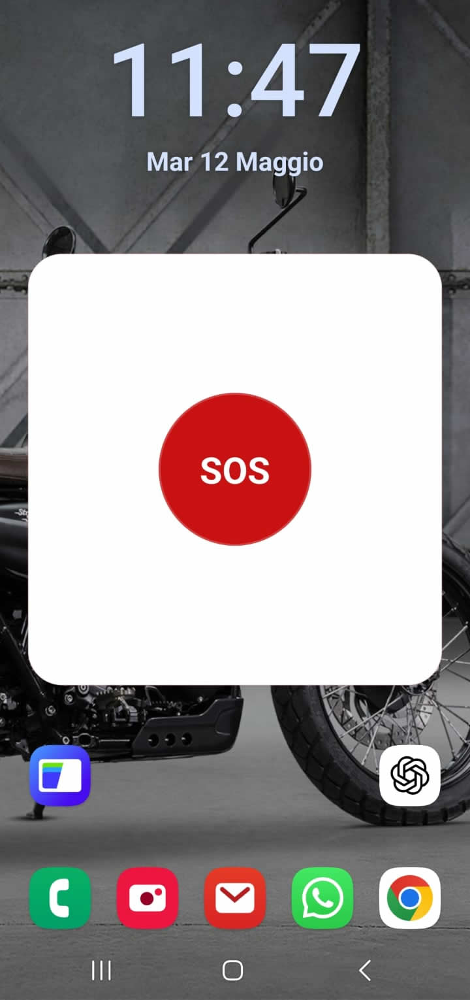

# Al Sicuro

Al Sicuro è un'app Android pensata per la sicurezza personale. Permette di inviare rapidamente richieste di aiuto via SMS ai propri contatti fidati, condividere la posizione e attivare strumenti di supporto in situazioni di rischio o disagio.

L'app è stata progettata per privilegiare rapidità, chiarezza e affidabilità: poche azioni, messaggi brevi, funzioni esplicite e strumenti pensati per essere utili anche quando l'utente è sotto stress.

## Panoramica

- SOS immediato con invio SMS ai contatti salvati
- Condivisione della posizione nel messaggio di emergenza
- Contatti SOS ordinabili per priorità
- Widget Home con doppio tocco di conferma
- SOS con scuotimento del dispositivo
- Timer SOS con invio automatico allo scadere
- Modalità percorso sicuro con aggiornamenti periodici
- Messaggio "Sono al sicuro"
- Numeri rapidi di emergenza
- Impostazioni con stato dei permessi e diagnostica di base

## Screenshot

### Home


### Impostazioni e permessi


### Widget SOS



## Architettura del progetto

Il progetto Android nativo è organizzato in modo semplice:

- `app/src/main/java/.../MainActivity.kt`
  Punto di ingresso dell'app e bootstrap della UI Compose.
- `app/src/main/java/.../HelpMeApplication.kt`
  Inizializza il canale notifiche usato dai servizi foreground.
- `app/src/main/java/.../ui/`
  Contiene la UI Compose e il `HelpMeViewModel`, che coordina schermate, stato e azioni utente.
- `app/src/main/java/.../data/`
  Contiene il livello di persistenza locale basato su `DataStore`.
- `app/src/main/java/.../services/`
  Contiene i servizi e la logica nativa per SOS, percorso sicuro, timer, scuotimento e invio SMS.
- `app/src/main/java/.../widget/`
  Contiene il widget Home che arma e conferma il SOS con doppio tocco.
- `assets/`
  Contiene immagini e risorse usate dalla UI e dall'onboarding.

## Flusso principale

1. All'avvio l'app carica lo stato locale e verifica se mostrare onboarding o dashboard.
2. L'utente configura i contatti SOS e, quando serve, concede i permessi richiesti.
3. Le azioni di emergenza partono dalla home, dal widget, dal timer o dal servizio di scuotimento.
4. Il `HelpMeViewModel` valida i prerequisiti e delega l'invio ai servizi nativi.
5. `EmergencyPlatform` compone il messaggio, recupera la posizione se disponibile e invia l'SMS ai contatti.
6. Gli eventi recenti vengono salvati localmente per mostrare stato e storico.

## Permessi utilizzati

- `SEND_SMS`
  Necessario per inviare gli SMS di emergenza.
- `READ_CONTACTS`
  Necessario per aggiungere i contatti SOS dalla rubrica.
- `ACCESS_FINE_LOCATION` e `ACCESS_COARSE_LOCATION`
  Necessari per allegare la posizione al messaggio.
- `ACCESS_BACKGROUND_LOCATION`
  Necessario per alcune modalità che devono continuare a funzionare anche quando l'app non è in primo piano.
- `POST_NOTIFICATIONS`
  Necessario per mostrare notifiche dei servizi attivi.
- `WAKE_LOCK` e `FOREGROUND_SERVICE`
  Necessari per mantenere affidabili i servizi in background.

## Tecnologie usate

- Kotlin
- Jetpack Compose
- AndroidX Lifecycle
- DataStore Preferences
- Google Play Services Location
- Servizi foreground Android
- App Widget Android

## Come compilare

### Requisiti

- Android Studio recente
- JDK compatibile con il progetto
- Android SDK installato

### Build debug o release

Apri direttamente questa cartella in Android Studio:

`D:\Lavori\App\HelpMe\HelpMe\android-native`

Da terminale, in questa cartella, puoi usare:

```powershell
.\gradlew.bat assembleDebug
.\gradlew.bat assembleRelease
.\gradlew.bat bundleRelease
```

## Output principali

- APK di test:
  `app/build/outputs/apk/release/app-release.apk`
- AAB per pubblicazione:
  `app/build/outputs/bundle/release/app-release.aab`

## Firma dell'app

La firma release è locale al progetto. I file di firma non devono essere pubblicati in repository pubblici.

File da mantenere privati:

- `keystore/`
- `keystore.properties`
- eventuali altri file `.jks` o `.keystore`

## Stato attuale del progetto

La base applicativa copre:

- onboarding
- dashboard
- contatti SOS
- invio SMS
- posizione
- timer SOS
- percorso sicuro
- scuotimento
- widget
- build APK/AAB firmate

## Note di sicurezza

Al Sicuro è uno strumento di supporto. Non sostituisce i numeri di emergenza, i servizi sanitari, le forze dell'ordine o i canali ufficiali di assistenza.

In situazioni di pericolo reale, l'utente deve contattare immediatamente i servizi di emergenza appropriati quando possibile.

## Licenza

Questo progetto è distribuito con licenza MIT. Vedi il file [LICENSE](LICENSE).
