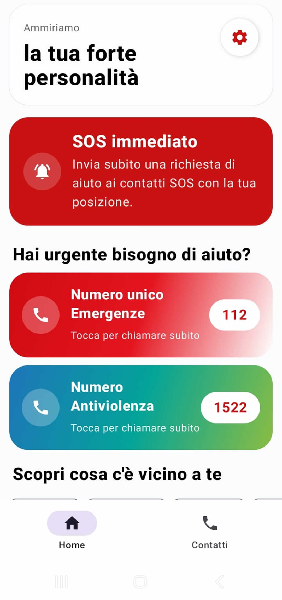
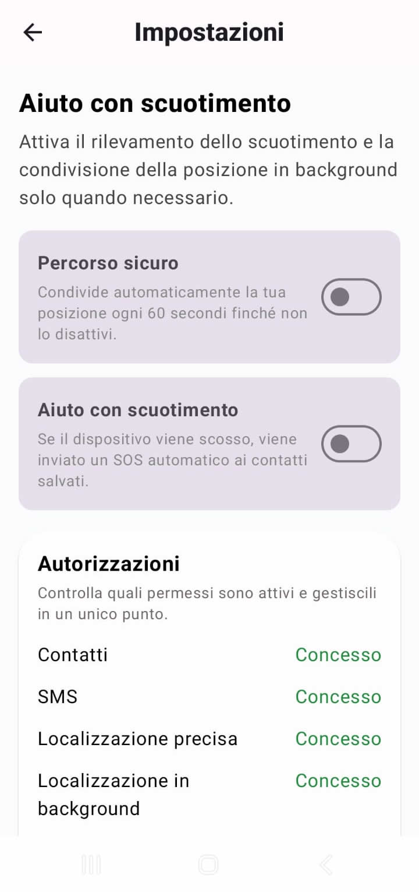

# 🛡️ Al Sicuro

<p align="center">
  
</p>

<p align="center">
  <b>Applicazione Android per la sicurezza personale</b><br>
  Invio rapido di SOS via SMS, condivisione posizione e strumenti di emergenza.
</p>

<p align="center">
  
  
  
</p>

---

## ✨ Caratteristiche principali

- 🚨 SOS immediato con invio SMS ai contatti salvati
- 📍 Condivisione automatica della posizione
- 👥 Contatti SOS ordinabili per priorità
- 🧩 Widget Home con doppio tocco di conferma
- 📳 Attivazione SOS tramite scuotimento dispositivo
- ⏳ Timer SOS con invio automatico allo scadere
- 🛣️ Modalità percorso sicuro con aggiornamenti periodici
- ✅ Messaggio rapido “Sono al sicuro”
- ☎️ Numeri di emergenza rapidi
- ⚙️ Diagnostica permessi e stato servizi

---

## 📱 Screenshot

<p align="center">
  
  
</p>

---

## ⚡ Filosofia dell'app

**Al Sicuro** è stata progettata per funzionare rapidamente anche in situazioni di stress o pericolo.

L'obiettivo è ridurre al minimo le azioni necessarie:

- pochi tocchi
- interfaccia chiara
- messaggi immediati
- funzioni essenziali e affidabili

---

## 🔄 Flusso dell'app

```text
Avvio App
   ↓
Controllo onboarding / dashboard
   ↓
Configurazione contatti SOS
   ↓
Concessione permessi necessari
   ↓
Attivazione emergenza
(Home / Widget / Shake / Timer)
   ↓
Validazione prerequisiti
   ↓
Recupero posizione
   ↓
Invio SMS ai contatti SOS
   ↓
Salvataggio eventi recenti
```

---

## 🔐 Permessi utilizzati

| Permesso | Utilizzo |
|---|---|
| `SEND_SMS` | Invio degli SMS di emergenza |
| `READ_CONTACTS` | Selezione contatti SOS |
| `ACCESS_FINE_LOCATION` | Condivisione posizione precisa |
| `ACCESS_COARSE_LOCATION` | Posizione approssimativa |
| `ACCESS_BACKGROUND_LOCATION` | Funzioni attive in background |
| `POST_NOTIFICATIONS` | Notifiche dei servizi attivi |
| `WAKE_LOCK` | Mantenimento servizi attivi |
| `FOREGROUND_SERVICE` | Esecuzione servizi foreground |

---

## 🧱 Tecnologie utilizzate

- Kotlin
- Jetpack Compose
- AndroidX Lifecycle
- DataStore Preferences
- Google Play Services Location
- Android Foreground Services
- Android App Widget

---

## 🚀 Requisiti

- Android Studio aggiornato
- Android SDK installato
- JDK compatibile con il progetto

---

## 📄 Licenza

Distribuito con licenza MIT.  
Consulta il file [LICENSE](LICENSE).

---

## ❤️ Obiettivo del progetto

L'app nasce con l'obiettivo di offrire uno strumento semplice e immediato per chiedere aiuto rapidamente in situazioni di emergenza o disagio.
